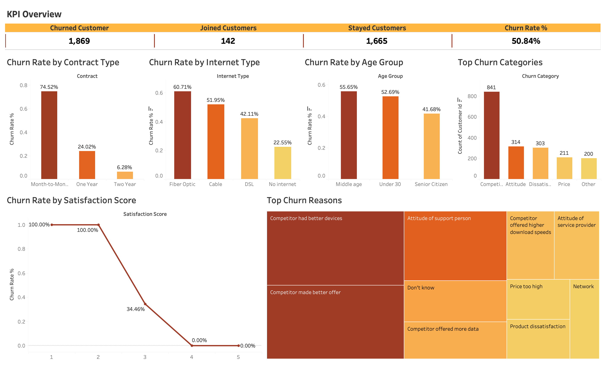
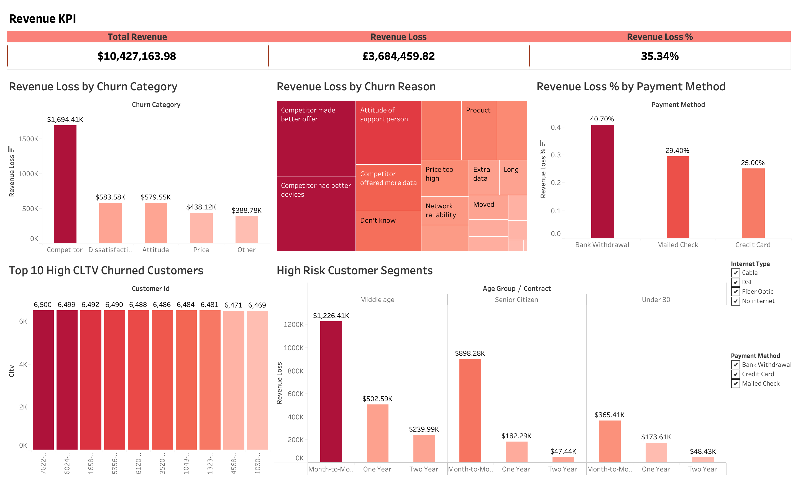

# 📡 Telecom Customer Churn Analysis

An end-to-end **data analytics portfolio project** analyzing telecom customer churn using **Python**, **SQL**, and **Tableau**.

This project covers the full analysis workflow: data cleaning, SQL-based business analysis, churn KPI calculation, revenue-loss analysis, customer segmentation, dashboard visualization, and business recommendations.

---

## 📌 Project Overview

Customer churn is one of the biggest challenges in the telecom industry. This project analyzes customer churn patterns to identify:

- why customers are leaving,
- which customer groups are at highest churn risk,
- which churn categories are causing the biggest revenue loss,
- which payment methods are linked with higher revenue-loss percentage,
- which high-value churned customers should be reviewed for win-back campaigns.

The goal is to turn customer data into business-ready insights that can support customer retention and revenue protection strategies.

**Overall Churn Rate: 50.84% | Revenue Lost: $3,684,459.82 | Overall Revenue Loss %: 35.34%**

---

## 🎯 Business Questions Answered

### Customer Churn Analysis

1. What is the overall customer churn rate?
2. How many customers churned, joined, and stayed?
3. Which contract type has the highest churn rate?
4. Which internet type has the highest churn rate?
5. How does satisfaction score affect churn?
6. Which age group has the highest churn rate?
7. What are the top churn categories?
8. What are the top churn reasons?

### Revenue Impact Analysis

9. What is the total revenue generated by customers?
10. How much revenue was lost due to churned customers?
11. What is the overall revenue loss percentage from churned customers?
12. Which churn category is associated with the highest revenue loss?
13. Which payment method has the highest revenue loss percentage?
14. Which customer segments have high churn risk and high revenue loss?
15. Which high-CLTV churned customers should be reviewed for win-back analysis?

---

## 🗂️ Repository Structure

```text
telco-customer-churn-analysis/
│
├── data/
│   ├── raw_telco.csv                         # Original raw dataset
│   └── cleaned_telco_churn.csv               # Cleaned dataset used for analysis
│
├── notebooks/
│   └── data_cleaning.ipynb                   # Python data cleaning notebook
│
├── sql/
│   └── churn_analysis.sql                    # SQL analysis for churn KPIs, revenue loss, segments, and recommendations
│
├── tableau/
│   └── telco_churn_dashboard.twb             # Tableau workbook
│
├── images/
│   ├── Churn_Analysis.png                    # Churn Analysis dashboard screenshot
│   └── Revenue_Impact_of_Customer_Churn.png  # Revenue Impact dashboard screenshot
│
├── README.md
├── requirements.txt
└── LICENSE
```

---

## 🛠️ Tools & Technologies

| Tool | Purpose |
|------|---------|
| Python | Data cleaning and preprocessing |
| Pandas | Data manipulation |
| SQL | KPI analysis, churn analysis, revenue-loss analysis, and business recommendations |
| Tableau | Dashboard design and visual storytelling |
| GitHub | Project documentation and portfolio presentation |

---

## 📊 Dashboards

### 1. Churn Analysis Dashboard

This dashboard focuses on customer churn behavior and shows churn KPIs, churn rate by contract type, internet type, age group, satisfaction score, top churn categories, and top churn reasons.



### 2. Revenue Impact Dashboard

This dashboard focuses on the financial impact of churn and shows total revenue, revenue loss, overall revenue loss percentage, revenue loss by churn category, revenue loss by churn reason, revenue loss percentage by payment method, high-CLTV churned customers, and high-risk customer segments.



---

## 📎 Project Presentation

A PDF summary presentation of this project is available here:

[View Project Presentation](presentations/Telco_Customer_Churn_Analysis_Presentation.pdf)

---

## 📂 Dataset

- **Source:** Telecom customer dataset cleaned for analysis
- **Rows:** 3,676 customers
- **Columns:** 44 features
- **Key columns:** `customer_id`, `contract`, `internet_type`, `satisfaction_score`, `churn_category`, `churn_reason`, `total_revenue`, `cltv`, `customer_status`, `age_group`, `payment_method`

---

## 🔍 Key Findings

| # | Insight |
|---|---------|
| 1 | Overall churn rate is **50.84%** |
| 2 | **1,869 customers churned**, while **1,665 stayed** and **142 joined** |
| 3 | **Month-to-Month contracts** have the highest churn rate at **74.52%** |
| 4 | **Fiber Optic** customers have the highest churn rate by internet type at **60.71%** |
| 5 | Customers with low satisfaction scores show the highest churn risk |
| 6 | **Middle-age customers** have the highest churn rate at **55.65%** |
| 7 | Competitor-related issues are major churn drivers |
| 8 | Total revenue lost due to churn is **$3,684,459.82** |
| 9 | Overall revenue loss percentage is **35.34%** |
| 10 | The **Competitor** churn category is associated with the highest revenue loss |
| 11 | **Bank Withdrawal** shows the highest revenue loss percentage by payment method in the dashboard |
| 12 | High-CLTV churned customers should be prioritized for win-back analysis |

---

## 💡 Business Recommendations

1. **Incentivize contract upgrades**  
   Encourage Month-to-Month customers to move to One Year or Two Year contracts using loyalty discounts, bundled plans, or long-term value offers.

2. **Target low-satisfaction customers early**  
   Customers with low satisfaction scores should receive proactive support, service recovery, and retention offers before they churn.

3. **Improve Fiber Optic customer experience**  
   Review pricing, service reliability, speed expectations, and support quality for Fiber Optic customers.

4. **Respond to competitor pressure**  
   Since competitor-related issues are a major churn driver, the business should benchmark competitor pricing, device offers, and promotional strategies.

5. **Review payment-method risk**  
   Since revenue loss percentage differs by payment method, payment experience and billing friction should be reviewed for higher-risk payment groups.

6. **Prioritize high-risk, high-revenue segments**  
   Retention campaigns should focus on segments with both high churn rates and high revenue loss.

7. **Create a win-back strategy for high-CLTV churned customers**  
   High-value churned customers should be targeted with personalized offers and service improvements.

---

## ▶️ How to Run This Project

### Python Data Cleaning

```bash
pip install -r requirements.txt
jupyter notebook notebooks/data_cleaning.ipynb
```

### SQL Analysis

Import the cleaned dataset into your SQL database, then run:

```sql
SOURCE sql/churn_analysis.sql;
```

### Tableau Dashboard

Open the Tableau workbook:

```text
tableau/telco_churn_dashboard.twb
```

If Tableau asks for the data source, reconnect it to:

```text
data/cleaned_telco_churn.csv
```

---

## 👤 Author

**Aditya Pandey**  
📧 adityapandey12391@gmail.com

---

## 📄 License

This project is licensed under the [MIT License](LICENSE).
